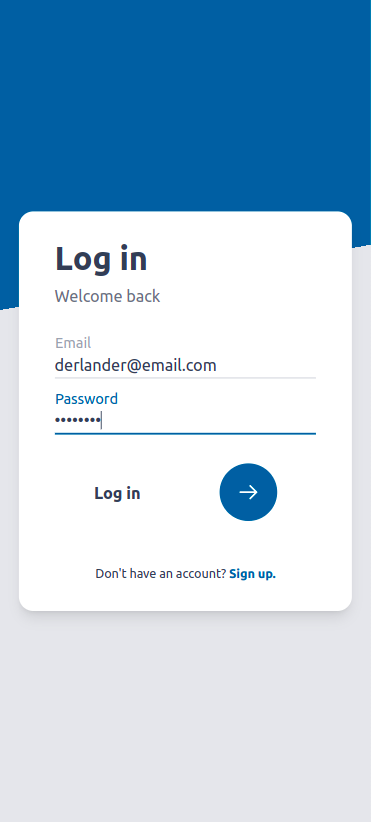
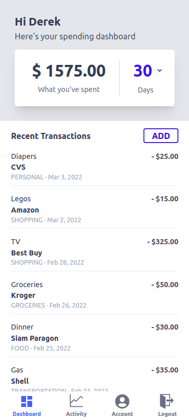
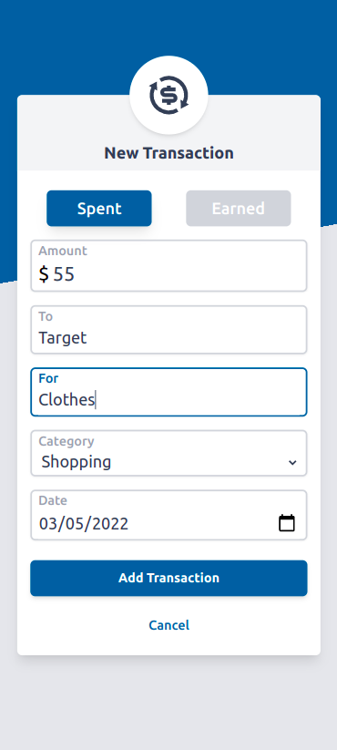
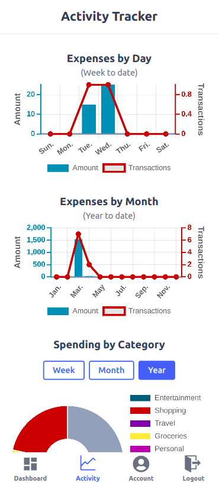
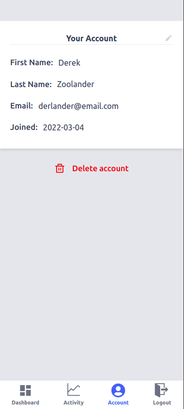

# Budget App Frontend

A tracking app for expenses.

The [Budget App](https://mdesanker.github.io/budget-frontend)

## Table of Contents

- [Description](#Description)
- [Motivation](#Motivation)
- [How to use](#How-to-use)
- [Built with](#Built-with)
  - [Frontend](#Frontend)
  - [Backend](#Backend)
- [Challenges](#Challenges)
- [Links](#Links)

## Description

This repository is the React frontend for the [Budget App](https://mdesanker.github.io/budget-frontend).

This expense tracking app allows users to track expenses with amount, who money was sent to or received from, a description of what the transaction was for, a transaction category, and date of the transaction. The dashboard displays total expenses, and a list of individual transactions over a 7 or 30 day period.

The activity tracker tab shows a break down of transactions day-by-day over the last week, and month-by-month over the last year. Users can also look at their spending in each category over time periods of a week, month, or year.

## Motivation

This app was created as a practice exercise to use TypeScript with React and Express, and use Tailwind CSS.

## How to use

1. Log in or register for an account

2. Dashboard view - view transactions over last 7 or 30 days. Add transactions. Select individual transactions to edit or delete.

3. Activity view - view spending trends displayed with three different charts.

4. Account view - view user name, email, and account creation date. Edit user name and email. Delete account.

## Built with

This app was built with the MERN stack in TypeScript.

### Frontend

- React
- React Router
- Redux
- Axios
- ChartJS
- Tailwind CSS

### Backend

- NodeJS
- ExpressJS
- JWT Authentication
- MongoDB/Mongoose
- supertest
- MongoMemoryServer

## Challenges

- Transaction dates - fixing transaction dates being saved as the day before the user selected date took a long time. I think the problem was caused by saving the date as just a "YYY-MM-DD" string, which removed the time zone data. All dates were then treated as UTC when I tried to display them using luxon's DateTime, instead of as UTC-5. I realized I could set DateTime as the type for the date input in my REST API transaction model, so that I could store the full DateTime object, including timezone information. Using this on the front end was tricky at first until I realized that the TypeScript type declaration was telling the IDE that `transaction.date` (an ISO string) was a DateTime object, despite `typeof transaction.date === "string"`. I found a work around by converting transaction.date to a string explicitly, then converting this back to a DateTime object so I could use luxon methods to manipulate the date: `DateTime.fromISO(transaction.date.toString()).toISODate()`.

  (this is my best guess at what was happening)

- Filtering transaction data - I used a single API call to fetch user transactions from the DB. Then I filtered the transactions into week, month, and year lists in redux extrareducers with helper functions so that they could be used in the dashboard and activity views. ChartJS made it relatively simple to use a function to map the days of the week or months of the year to filter the selected transactions. This is approach would be a lot more resource intensive in a large app with a massive amount of transactions. In that case, it would be better to use API endpoints to query the database for specific transactions.

## Links

- [API Repository](https://github.com/mdesanker/budget-api)
